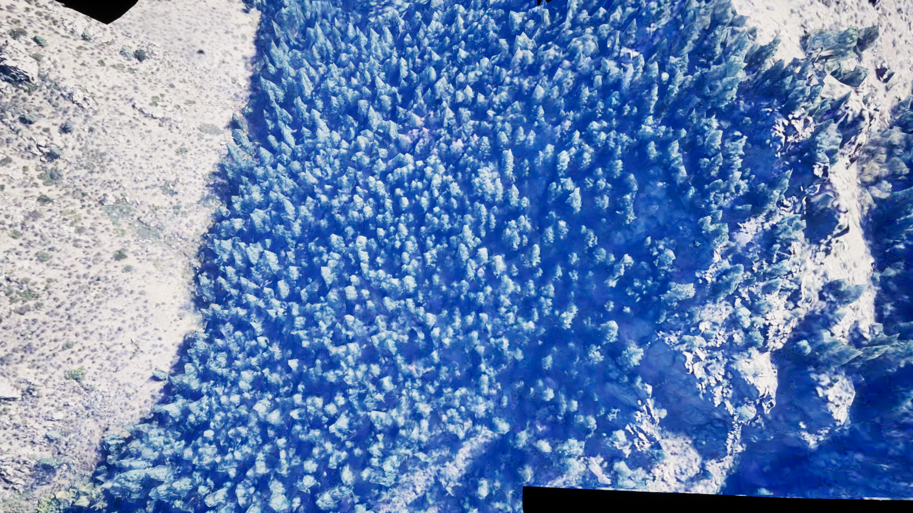
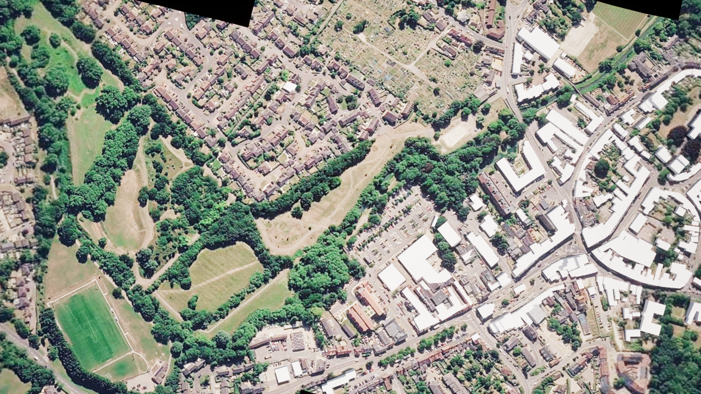
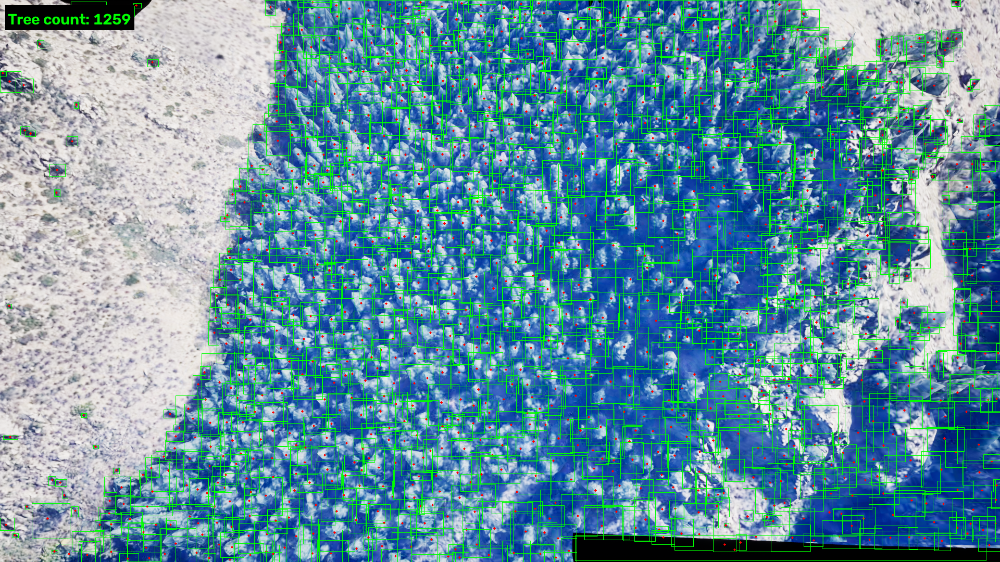
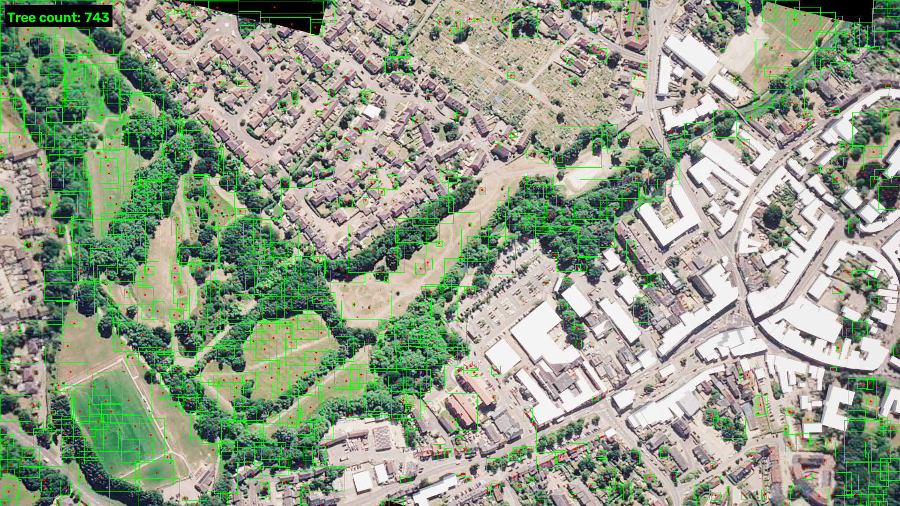
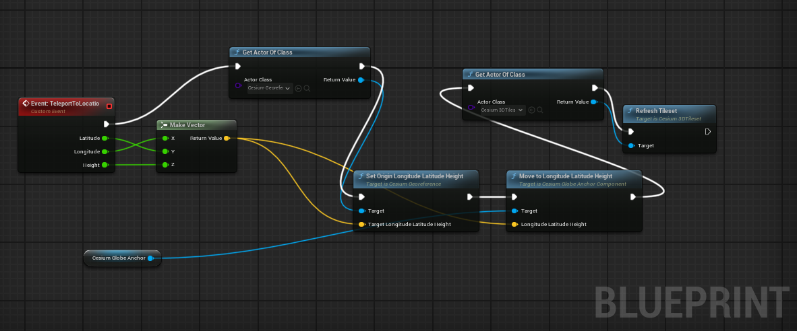
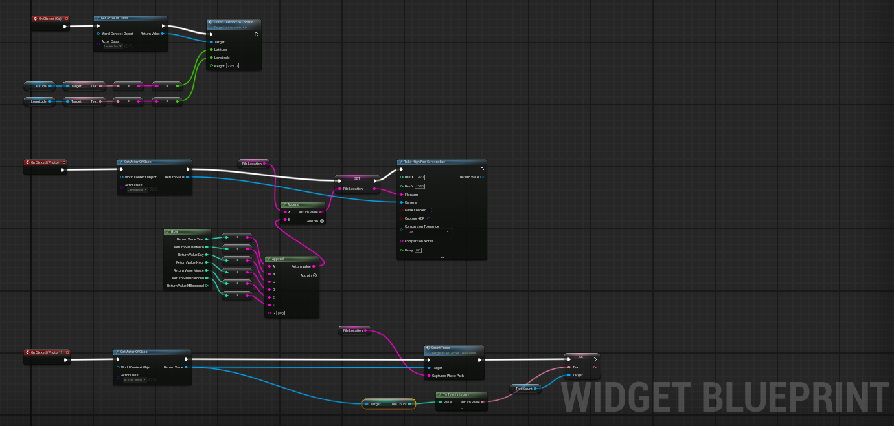
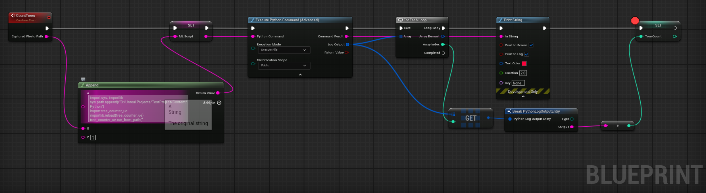

# UE Aerial Tree Counter (Cesium for Unreal + Python/OpenCV)

Geolocate to any latitude/longitude in Unreal Engine, capture the Cesium 3D
Tiles aerial view from above, and automatically count and box every tree
visible in the capture — no training data, no model weights, running
entirely in-editor via Unreal's Python Editor Script Plugin.

| Crystal-forest test capture | Real-world capture (Google Maps tiles via Cesium ion) |
|---|---|
|  |  |
|  |  |
| **1,259 trees detected** | **743 trees detected** |

## How it works

The pipeline is three Blueprints handing off to one Python script:

1. **Go to a location** (`LocateToLocation` actor) — a widget takes a
   latitude/longitude, and a `Custom Event` on this actor calls
   `Move To Longitude Latitude Height` on its `Cesium Globe Anchor`
   component, teleporting it (and the camera) to that point on the globe.
   Cesium's tileset streams in the terrain/imagery around the new position.

   

2. **Capture the scene** (`Widget BP`) — a "Photo" button fires
   `Take High Res Screenshot`, saving a PNG to disk with a timestamped
   filename.

   

3. **Count the trees** (`ML_Actor_treecount` actor, `CountTrees` event) —
   builds a one-line Python statement (import the counting module, call it
   with the screenshot's path) and runs it via `Execute Python Command
   (Advanced)` in **Execute Statement** mode. The script prints a single
   bare integer — the tree count — which Blueprint reads back out of the
   node's `Log Output` array and converts straight to an `Int`.

   

### The counting algorithm (`tree_counter_ue.py`)

Classical computer vision, not a trained model:

1. **Segment canopy from ground** — threshold the HSV *saturation*
   channel (tree canopy reads as saturated color; bare ground/rock/road
   reads as desaturated white/tan), then clean up the mask with
   morphological open/close.
2. **Find tree tops** — each tree's sunlit tip is a local brightness
   peak; `skimage.feature.peak_local_max` finds all such peaks inside the
   canopy mask, spaced a minimum distance apart.
3. **Split touching canopies** — a marker-controlled watershed
   (`skimage.segmentation.watershed`), seeded at those peaks, splits the
   canopy mask into one region per tree, even where crowns visually
   overlap.
4. **Filter and count** — regions that are too small (noise) or
   implausibly large (undersegmented clumps) are discarded; everything
   left gets a bounding box, and the count is the number of surviving
   regions.

No ground-truth training set, no GPU inference — just OpenCV + scikit-image,
tuned against the example captures above.

## Setup

1. Install the **Cesium for Unreal** plugin and get a scene georeferenced
   and streaming (tileset + `CesiumGeoreference` in your level).
2. Enable **Python Editor Script Plugin** (Edit → Plugins).
3. Install the Python dependencies into Unreal's *own* bundled Python
   interpreter (not your system Python) — find its path from the
   in-editor Python console with `import sys; print(sys.executable)`,
   then:
   ```
   "<path from above>" -m pip install opencv-python numpy scipy scikit-image
   ```
4. Drop `tree_counter_ue.py` into `<YourProject>/Content/Python/`
   (Unreal auto-adds that folder to `sys.path`).
5. Build the three Blueprints as described above (or adapt your own —
   the only hard requirement is that something calls
   `tree_counter_ue.run_from_path(<image path>)` via `Execute Python
   Command (Advanced)` in **Execute Statement** mode, after the
   screenshot has actually finished writing to disk).

## Known limitations

- **Heuristic, not a trained detector.** It works well on imagery where
  each tree has a visible highlight/shadow separating it from its
  neighbors (true of both examples above). Flatter lighting, a different
  color palette, or much denser canopy will need the tunables at the top
  of `tree_counter_ue.py` (`SAT_THRESH`, `MIN_TREE_PX`, `MIN_BLOB_AREA`,
  `MAX_BLOB_AREA_FRAC`) retuned, or ultimately a trained model swapped in.
- **Editor-only.** This uses Unreal's Python Editor Script Plugin, which
  doesn't exist in a packaged/shipping build. Running this in a shipped
  game would mean porting the algorithm to C++ or bundling a portable
  Python distribution and shelling out to it.
- **Screenshot capture is asynchronous.** `Take High Res Screenshot`
  returns before the file is finished writing; the Blueprint has to wait
  (a Delay, or a poll loop) before handing the path to Python, or the
  read will fail.

## Repo layout

```
Content/Python/tree_counter_ue.py   # the counting algorithm + Blueprint entry point
docs/screenshots/                   # blueprint graphs + example captures (this README)
```
